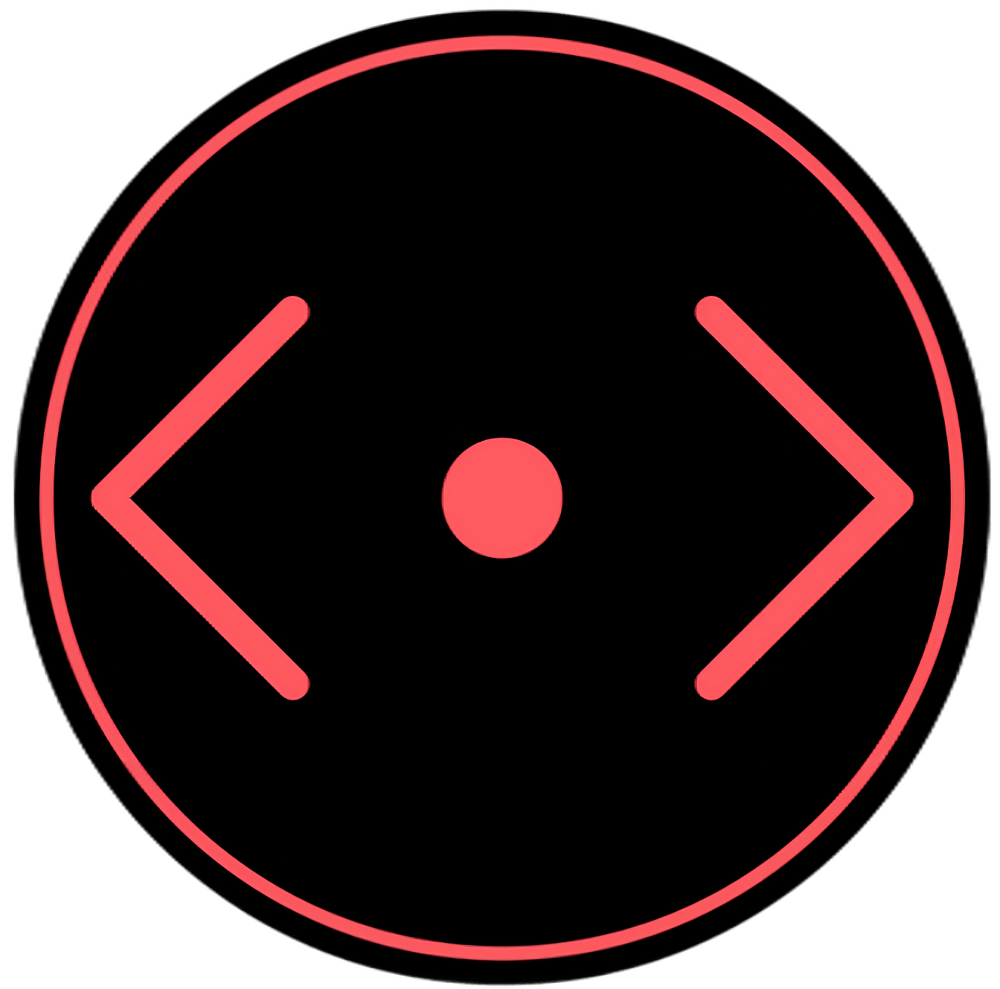

<div align="center">

# Oh My Node | 9-grade-html-css-js-project

</div>

<div align="center">
  
</div>


<div align="center">


</div>

<div align="center">
  
  
  
  
  
  
  
  
  
  
  
</div>

## Table of Contents

- [Project Description](#project-description)
  - [Features](#features)
- [Tech Stack](#tech-stack)
- [Project Structure](#project-structure)
- [Getting Started](#getting-started)
  - [Prerequisites](#prerequisites)
  - [Installation](#installation)
  - [Development](#development)
  - [Building](#building)
- [Contributors](#contributors)

## Project Description

Oh My Node is a student website application built with React and TypeScript. It provides students with a comprehensive view of their academic progress, assignments, achievements, and course information. The application features a modern UI with smooth animations and theme support.

### Features

- **User Authentication**: Secure login with Supabase Auth
- **Website Overview**: View academic progress at a glance
- **Subject Management**: Track grades and performance trends for each subject
- **Assignment Tracking**: Monitor assignment status and due dates
- **Achievements**: Unlock and view achievements based on milestones
- **Theme Support**: Light and dark mode toggling
- **Responsive Design**: Works seamlessly on desktop and mobile devices
- **Smooth Animations**: Framer Motion animations for enhanced UX

## Tech Stack

- **Frontend Framework**: React 19 with TypeScript
- **Styling**: TailwindCSS
- **Build Tool**: Vite
- **Animation**: Framer Motion
- **Backend**: Supabase (Authentication & Database)
- **Package Manager**: pnpm
- **Icons**: Lucide React

## Project Structure

```
src/
├── assets/
├── components/
│   ├── layout/
│   ├── sections/
│   ├── ui/
│   └── ProtectedRoute.tsx
├── context/
├── data/
├── hooks/
├── lib/
├── pages/
├── styles/
├── App.tsx
└── main.tsx
```

## Getting Started

### Prerequisites

- Node.js 18+ and pnpm installed

### Installation

Clone the repository and install dependencies:

```bash
git clone https://github.com/codingburgas/2526-dual-education-oh-my-node.git
cd 2526-dual-education-oh-my-node
pnpm install
```

### Development

Start the development server:

```bash
pnpm run dev
```

The application will be available at `http://localhost:5173`

### Building

Build for production:

```bash
pnpm run build
```

Preview the production build:

```bash
pnpm run preview
```

## Contributors

- **Denislav Dimov** - [@didimov24](https://github.com/didimov24)
- **Georgi Georgiev** - [@gageorgiev24](https://github.com/gageorgiev24)
